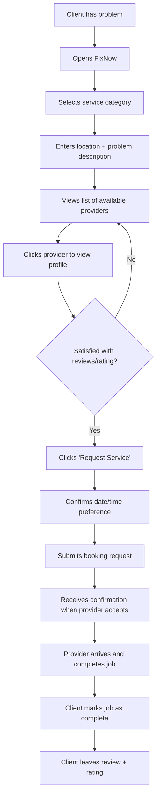
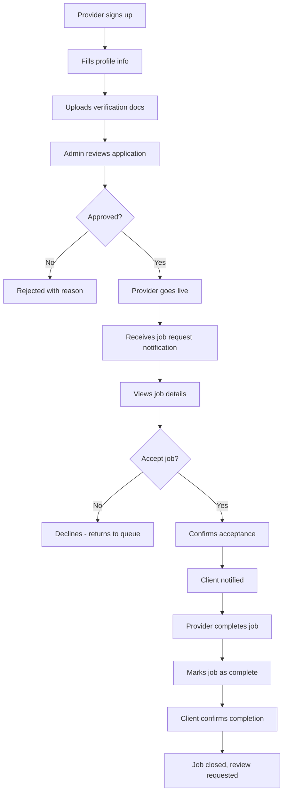
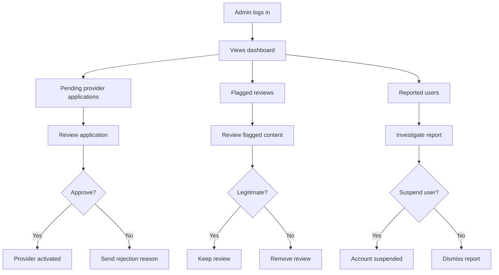
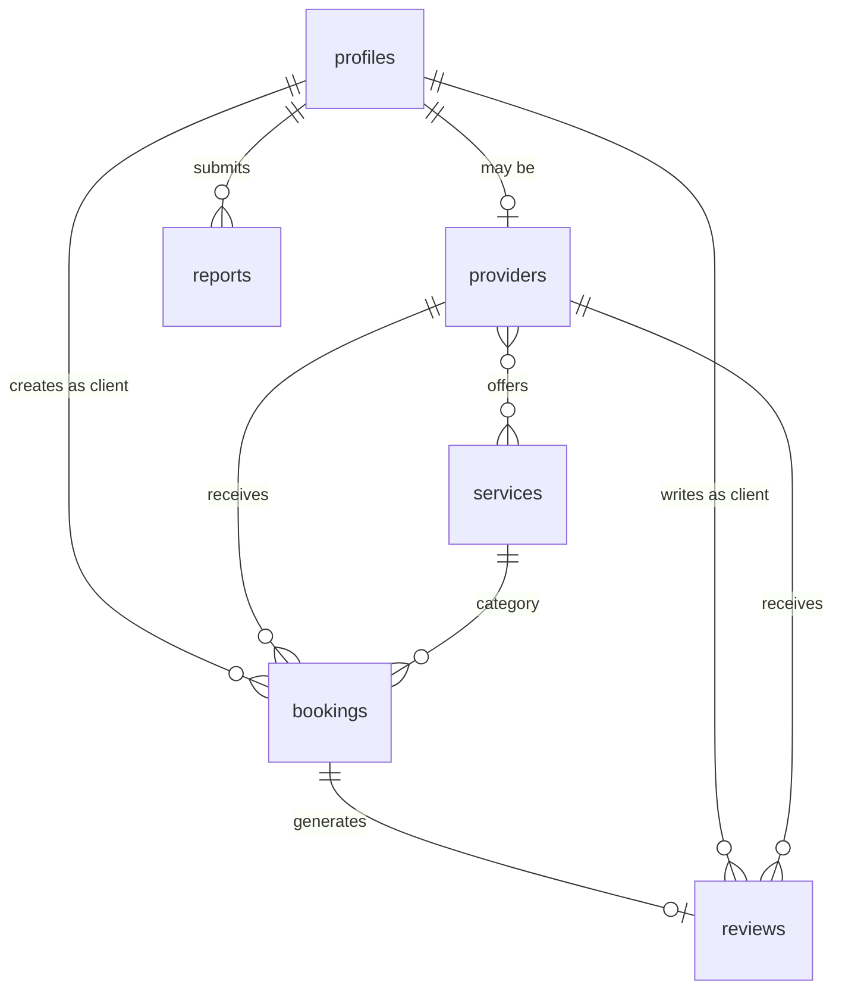

# FixNow: Service Marketplace MVP Plan

A comprehensive product and technical blueprint for building a handyman/repair services marketplace in 6-8 weeks.

---

## 1. MVP Definition

### What "Usable MVP" Means for FixNow

A **usable MVP** is the minimum product that:

- Allows a real person with a problem (e.g., leaky faucet) to find and book a verified service provider
- Allows a real service provider to receive, accept, and complete jobs
- Builds enough trust that both sides are willing to transact
- Works reliably without manual intervention

### Problems It MUST Solve

| For Clients                                               | For Providers                                  |
| --------------------------------------------------------- | ---------------------------------------------- |
| "I need a plumber NOW, but don't know who to trust"       | "I need more customers without paying for ads" |
| "I want to see if this person is reliable before booking" | "I want to know job details before committing" |
| "I need to know when they'll arrive"                      | "I want to build a reputation over time"       |
| "I want to leave feedback if something goes wrong"        | "I want a simple way to manage my jobs"        |

### What MVP is NOT

- NOT a full payment system (cash is acceptable)
- NOT a real-time bidding/auction system
- NOT a chat platform with file sharing
- NOT a scheduling/calendar optimization tool

---

## 2. User Flows

### 2.1 Client Flow: Problem → Booking → Review



**Step-by-step:**

1. **Sign up/Login** - Email + password (Supabase Auth)
2. **Select Service** - Choose from: Plumber, Electrician, Locksmith, Computer Repair
3. **Describe Problem** - Location (address) + brief description + optional photo
4. **Browse Providers** - See list filtered by: service type, location, availability
5. **View Provider Profile** - Photo, bio, rating, reviews, verification badge
6. **Request Booking** - Select preferred date/time window
7. **Wait for Acceptance** - Provider accepts/declines (push notification via email)
8. **Job Completion** - Both parties confirm job is done
9. **Leave Review** - 1-5 stars + text (only after job completion)

---

### 2.2 Provider Flow: Signup → Accept Job → Complete



**Step-by-step:**

1. **Sign up** - Email + password, mark as "Provider"
2. **Complete Profile** - Name, photo, bio, service categories, service area (city/zip)
3. **Submit Verification** - Upload ID document + proof of skill (license, certification, or portfolio)
4. **Wait for Approval** - Admin manually reviews (24-48 hours target)
5. **Go Live** - Profile visible to clients
6. **Receive Requests** - Email notifications for new job requests in service area
7. **Accept/Decline** - View job details, accept or decline with reason
8. **Complete Job** - Arrive, do work, mark complete
9. **Get Reviewed** - Build reputation through ratings

---

### 2.3 Admin Flow: Approve, Moderate, Suspend



**Admin Capabilities:**

1. **Provider Management** - Approve/reject applications, suspend providers
2. **Content Moderation** - Review flagged reviews, remove inappropriate content
3. **User Management** - Handle reports, suspend bad actors
4. **Basic Analytics** - View signup counts, booking counts, completion rates

---

## 3. Feature List

### 3.1 MUST HAVE (Non-Negotiable for MVP)

| Feature                   | Scope                                                                             |
| ------------------------- | --------------------------------------------------------------------------------- |
| **Email/Password Auth**   | Sign up, login, logout, password reset                                            |
| **User Roles**            | Client, Provider, Admin (via metadata)                                            |
| **Provider Profile**      | Photo, name, bio, services, service area, rating                                  |
| **Provider Verification** | Document upload, admin approval workflow                                          |
| **Service Categories**    | 4 categories: Plumber, Electrician, Locksmith, Computer Repair                    |
| **Provider Search**       | Filter by service type, location (city-level)                                     |
| **Booking Request**       | Client submits request with: service, description, location, date/time preference |
| **Accept/Decline Flow**   | Provider can accept or decline requests                                           |
| **Job Status Tracking**   | States: Pending → Accepted → In Progress → Completed → Cancelled                  |
| **Job Completion**        | Both parties confirm completion                                                   |
| **Reviews & Ratings**     | 1-5 stars + text, only after job completion                                       |
| **Email Notifications**   | Booking request, acceptance, completion, review                                   |
| **Admin Dashboard**       | Approve providers, view bookings, suspend users                                   |
| **Mobile Responsive UI**  | Works on phones and tablets                                                       |

### 3.2 NICE TO HAVE (Post-MVP)

| Feature                        | Reason to Defer                           |
| ------------------------------ | ----------------------------------------- |
| In-app messaging/chat          | Email works for MVP; adds complexity      |
| Real-time notifications        | Email is sufficient initially             |
| Payment processing             | Cash works; Stripe adds compliance burden |
| Advanced scheduling            | Simple time preferences work first        |
| Provider availability calendar | Manual accept/decline is simpler          |
| Photo before/after             | Nice but not critical for trust           |
| GPS tracking                   | Significant complexity                    |
| Multi-language support         | English first                             |
| Provider subscription tiers    | Revenue model comes later                 |
| Client loyalty/discounts       | Post product-market fit                   |

### 3.3 DO NOT BUILD (Explicitly Excluded)

| Excluded                     | Why                                |
| ---------------------------- | ---------------------------------- |
| Real-time bidding            | Overcomplicates MVP                |
| Service package builder      | Too complex                        |
| Escrow payments              | Legal/compliance complexity        |
| Background check integration | Expensive, use manual verification |
| Provider route optimization  | Not needed until scale             |
| Video calling                | Overkill                           |
| Custom pricing calculator    | Providers set their own rates      |
| B2B / commercial jobs        | Focus on consumers                 |
| Recurring bookings           | One-off first                      |

---

## 4. Database & Supabase Architecture

### 4.1 Core Tables

```sql
-- Users table (extends Supabase auth.users)
CREATE TABLE public.profiles (
  id UUID REFERENCES auth.users(id) PRIMARY KEY,
  email TEXT NOT NULL,
  full_name TEXT,
  phone TEXT,
  avatar_url TEXT,
  role TEXT DEFAULT 'client' CHECK (role IN ('client', 'provider', 'admin')),
  created_at TIMESTAMPTZ DEFAULT now(),
  updated_at TIMESTAMPTZ DEFAULT now()
);

-- Provider-specific information
CREATE TABLE public.providers (
  id UUID REFERENCES public.profiles(id) PRIMARY KEY,
  bio TEXT,
  service_area TEXT, -- City or zip code region
  hourly_rate DECIMAL(10,2),
  is_verified BOOLEAN DEFAULT false,
  is_active BOOLEAN DEFAULT false,
  verification_status TEXT DEFAULT 'pending'
    CHECK (verification_status IN ('pending', 'approved', 'rejected')),
  verification_notes TEXT,
  id_document_url TEXT,
  certification_url TEXT,
  average_rating DECIMAL(3,2) DEFAULT 0,
  total_reviews INTEGER DEFAULT 0,
  total_jobs_completed INTEGER DEFAULT 0,
  created_at TIMESTAMPTZ DEFAULT now(),
  updated_at TIMESTAMPTZ DEFAULT now()
);

-- Service categories
CREATE TABLE public.services (
  id UUID DEFAULT gen_random_uuid() PRIMARY KEY,
  name TEXT NOT NULL UNIQUE, -- 'plumber', 'electrician', etc.
  display_name TEXT NOT NULL,
  description TEXT,
  icon TEXT,
  is_active BOOLEAN DEFAULT true,
  created_at TIMESTAMPTZ DEFAULT now()
);

-- Provider ↔ Service junction
CREATE TABLE public.provider_services (
  provider_id UUID REFERENCES public.providers(id) ON DELETE CASCADE,
  service_id UUID REFERENCES public.services(id) ON DELETE CASCADE,
  PRIMARY KEY (provider_id, service_id)
);

-- Bookings
CREATE TABLE public.bookings (
  id UUID DEFAULT gen_random_uuid() PRIMARY KEY,
  client_id UUID REFERENCES public.profiles(id) NOT NULL,
  provider_id UUID REFERENCES public.providers(id) NOT NULL,
  service_id UUID REFERENCES public.services(id) NOT NULL,

  status TEXT DEFAULT 'pending' CHECK (status IN (
    'pending',      -- Awaiting provider response
    'accepted',     -- Provider accepted
    'in_progress',  -- Job started
    'completed',    -- Job finished
    'cancelled',    -- Cancelled by either party
    'declined'      -- Provider declined
  )),

  description TEXT NOT NULL,
  location_address TEXT NOT NULL,
  location_city TEXT NOT NULL,
  preferred_date DATE,
  preferred_time_slot TEXT, -- 'morning', 'afternoon', 'evening'

  client_confirmed BOOLEAN DEFAULT false,
  provider_confirmed BOOLEAN DEFAULT false,

  cancelled_by UUID REFERENCES public.profiles(id),
  cancellation_reason TEXT,
  decline_reason TEXT,

  completed_at TIMESTAMPTZ,
  created_at TIMESTAMPTZ DEFAULT now(),
  updated_at TIMESTAMPTZ DEFAULT now()
);

-- Reviews
CREATE TABLE public.reviews (
  id UUID DEFAULT gen_random_uuid() PRIMARY KEY,
  booking_id UUID REFERENCES public.bookings(id) NOT NULL UNIQUE,
  client_id UUID REFERENCES public.profiles(id) NOT NULL,
  provider_id UUID REFERENCES public.providers(id) NOT NULL,
  rating INTEGER NOT NULL CHECK (rating >= 1 AND rating <= 5),
  comment TEXT,
  is_flagged BOOLEAN DEFAULT false,
  flag_reason TEXT,
  created_at TIMESTAMPTZ DEFAULT now()
);

-- Admin reports/flags
CREATE TABLE public.reports (
  id UUID DEFAULT gen_random_uuid() PRIMARY KEY,
  reporter_id UUID REFERENCES public.profiles(id) NOT NULL,
  reported_user_id UUID REFERENCES public.profiles(id),
  reported_review_id UUID REFERENCES public.reviews(id),
  reason TEXT NOT NULL,
  status TEXT DEFAULT 'pending' CHECK (status IN ('pending', 'resolved', 'dismissed')),
  admin_notes TEXT,
  resolved_by UUID REFERENCES public.profiles(id),
  created_at TIMESTAMPTZ DEFAULT now(),
  resolved_at TIMESTAMPTZ
);
```

### 4.2 Entity Relationships



### 4.3 Row Level Security (RLS) Strategy

| Table                 | Policy Summary                                                                      |
| --------------------- | ----------------------------------------------------------------------------------- |
| **profiles**          | Users can read all profiles; can only update their own                              |
| **providers**         | Anyone can read active/verified providers; providers can update their own           |
| **services**          | Public read; admin write only                                                       |
| **provider_services** | Providers can manage their own; public read                                         |
| **bookings**          | Clients see their bookings; providers see bookings assigned to them; admins see all |
| **reviews**           | Public read (for trust); only booking client can create; no edits after creation    |
| **reports**           | Reporter can create; admins can read all                                            |

**Key Security Decisions:**

1. **Bookings are private** - Only the client and provider involved can see details
2. **Reviews are public** - Anyone can read reviews (core to trust)
3. **Reviews are write-once** - No editing after submission (integrity)
4. **Provider verification docs are admin-only** - RLS hides from public
5. **Soft deletes over hard deletes** - Keep audit trail

---

## 5. Trust & Safety System

### 5.1 Provider Verification

| Step                   | Implementation                                                      |
| ---------------------- | ------------------------------------------------------------------- |
| **Identity Check**     | Require government ID upload (admin manual review)                  |
| **Skill Proof**        | Request license/certification OR portfolio (3+ photos of past work) |
| **Manual Approval**    | Admin reviews within 48 hours; can request additional info          |
| **Verification Badge** | Visible on profile after approval                                   |
| **Ongoing Monitoring** | Suspend after 3+ low ratings or serious complaint                   |

> **IMPORTANT:** Do NOT build automated background checks for MVP. Too expensive and complex. Manual review is sufficient at this scale.

### 5.2 Review Integrity Rules

| Rule                       | Enforcement                                               |
| -------------------------- | --------------------------------------------------------- |
| **One review per booking** | Database unique constraint                                |
| **Only completed jobs**    | Check booking status = 'completed' before allowing review |
| **No self-reviews**        | Check client_id ≠ provider user_id                        |
| **No edits**               | No UPDATE policy on reviews table                         |
| **Flag for moderation**    | Users can report suspicious reviews                       |
| **Time window**            | Reviews allowed within 14 days of completion              |

### 5.3 Abuse Prevention

| Threat             | Mitigation                                             |
| ------------------ | ------------------------------------------------------ |
| **Fake providers** | Manual verification; require ID                        |
| **Fake reviews**   | One per booking; must be completed job                 |
| **Review bombing** | Admin can flag/remove; rate limit reports              |
| **No-shows**       | Track cancellation rate; warn/suspend repeat offenders |
| **Harassment**     | Report system; admin can suspend                       |
| **Spam profiles**  | Manual provider approval; email verification           |

> **NOTE:** At MVP scale, most abuse can be handled manually. Build the reporting infrastructure, but don't over-automate.

---

## 6. 6–8 Week MVP Roadmap

### Week 1: Foundation ✅

**Build:**

- [x] Set up Supabase project (Auth, Database)
- [x] Create database schema (all tables, RLS policies)
- [x] Basic Next.js app structure with routing
- [x] Auth flows: Sign up, Login, Logout, Password reset
- [x] Basic profile management (create/edit)

**Test:**

- Auth flow works end-to-end
- User can create account and login

---

### Week 2: Provider Onboarding

**Build:**

- [ ] Provider registration flow (separate from client)
- [ ] Provider profile form (bio, services, area)
- [ ] Document upload (ID, certification) to Supabase Storage
- [ ] Provider dashboard (view own profile)
- [ ] Seed service categories

**Test:**

- Provider can complete full registration
- Documents upload successfully
- Provider sees pending status

---

### Week 3: Admin & Verification

**Build:**

- [ ] Admin dashboard (protected route)
- [ ] View pending provider applications
- [ ] Approve/reject providers with notes
- [ ] Email notification on approval/rejection
- [ ] Provider "verified" badge display

**Test:**

- Admin can approve provider
- Provider receives email, status updates
- Approved provider visible in system

---

### Week 4: Search & Browse

**Build:**

- [ ] Client home page with service category selection
- [ ] Provider search/list page (filtered by service + city)
- [ ] Provider profile view (public)
- [ ] Display ratings, reviews count, verification status
- [ ] Mobile responsive layouts

**Test:**

- Client can browse providers by category
- Provider profiles load correctly
- Works on mobile

---

### Week 5: Booking Flow

**Build:**

- [ ] Booking request form (description, location, date/time)
- [ ] Submit booking (creates pending record)
- [ ] Provider notified via email
- [ ] Provider can view incoming requests
- [ ] Accept/Decline actions
- [ ] Client notified of acceptance

**Test:**

- Full booking flow works
- Both parties receive emails
- Status updates correctly

---

### Week 6: Job Completion & Reviews

**Build:**

- [ ] Job status updates (in progress → completed)
- [ ] Both parties confirm completion
- [ ] Review form (appears after completion)
- [ ] Review display on provider profile
- [ ] Average rating calculation (database trigger or app logic)
- [ ] Client booking history

**Test:**

- Job can be marked complete
- Review can be submitted
- Rating appears on profile

---

### Week 7: Polish & Safety

**Build:**

- [ ] Report user/review functionality
- [ ] Admin moderation view (flagged content)
- [ ] Cancellation flow with reason
- [ ] Provider job history
- [ ] Email templates (professional formatting)
- [ ] Error handling and edge cases

**Test:**

- Report flow works
- Admin can moderate
- All error states handled gracefully

---

### Week 8: Testing & Launch Prep

**Build:**

- [ ] Bug fixes from testing
- [ ] Performance optimization
- [ ] SEO basics (meta tags, descriptions)
- [ ] Production environment setup
- [ ] Basic analytics (Supabase dashboard or Plausible)

**Test:**

- Full user journey (client)
- Full user journey (provider)
- Full admin workflow
- Mobile testing (3+ devices)
- Load testing (basic)

---

## 7. Success Criteria for MVP

### Quantitative Metrics

| Metric                 | Target                          | Why                           |
| ---------------------- | ------------------------------- | ----------------------------- |
| **Provider Signups**   | 20+ verified providers          | Minimum supply to test demand |
| **Client Signups**     | 50+ registered clients          | Minimum demand pool           |
| **Bookings Completed** | 10+ completed jobs              | Proves core loop works        |
| **Review Rate**        | 50%+ of completed jobs reviewed | Shows engagement              |
| **Repeat Clients**     | 3+ clients make 2nd booking     | Early retention signal        |

### Qualitative Signals

| Signal                    | What to Look For                              |
| ------------------------- | --------------------------------------------- |
| **Word of Mouth**         | Clients refer friends without prompting       |
| **Provider Satisfaction** | Providers actively log in and check for jobs  |
| **Low Support Volume**    | Users complete flows without asking for help  |
| **Positive Reviews**      | Reviews mention "easy", "fast", "trustworthy" |

### Product-Market Fit Early Indicators

1. **Providers ask about payment feature** → They want to make it their primary platform
2. **Clients share provider profiles** → Trust is being established
3. **Low cancellation rate** → Both sides find value
4. **Organic growth** → New users without marketing spend

---

## 8. Common Mistakes to Avoid

### 8.1 Overbuilding

| Mistake                  | Why It Hurts                         | What to Do Instead                                    |
| ------------------------ | ------------------------------------ | ----------------------------------------------------- |
| Building chat from day 1 | 2+ weeks of work; email works        | Use email notifications for MVP                       |
| Building payment system  | Legal complexity, Stripe integration | Allow cash; add payments later                        |
| Complex scheduling UI    | Calendar builders are time sinks     | Simple date + time slot dropdown                      |
| Real-time everything     | WebSocket complexity                 | Supabase Realtime only where critical (notifications) |
| Provider mobile app      | 2x the work                          | Responsive web works on all devices                   |

### 8.2 Wrong Prioritization

| Mistake                       | Why It Hurts                     | Correct Priority            |
| ----------------------------- | -------------------------------- | --------------------------- |
| Polish before function        | Wasted effort on unused features | Get core loop working first |
| Admin tools before user flows | No users = no need to admin      | Users > Providers > Admins  |
| All 4 services at once        | Spread too thin                  | Launch with 1-2, add more   |
| Perfect search                | Early users are local            | City filter is enough       |

### 8.3 Marketplace Cold-Start Errors

| Mistake                     | Why It Hurts                                | Solution                              |
| --------------------------- | ------------------------------------------- | ------------------------------------- |
| Launching without providers | Clients arrive, find nothing, leave forever | Recruit 10-20 providers BEFORE launch |
| Treating both sides equally | Providers are harder to get                 | Over-invest in provider experience    |
| Wide geographic launch      | Dilutes supply                              | Start in ONE city                     |
| No manual onboarding        | First providers need handholding            | Personally onboard first 20 providers |
| Ignoring provider economics | They'll leave if unprofitable               | Make sure they get bookings quickly   |

> **WARNING:** The #1 marketplace killer: launching demand marketing before you have supply. Always sequence: Supply → Demand → Scale.

---

## Next Steps

1. Set up Supabase project (get project URL + anon key)
2. Run `supabase/schema.sql` in SQL Editor
3. Add credentials to `.env.local`
4. Continue with Week 2: Provider Onboarding
